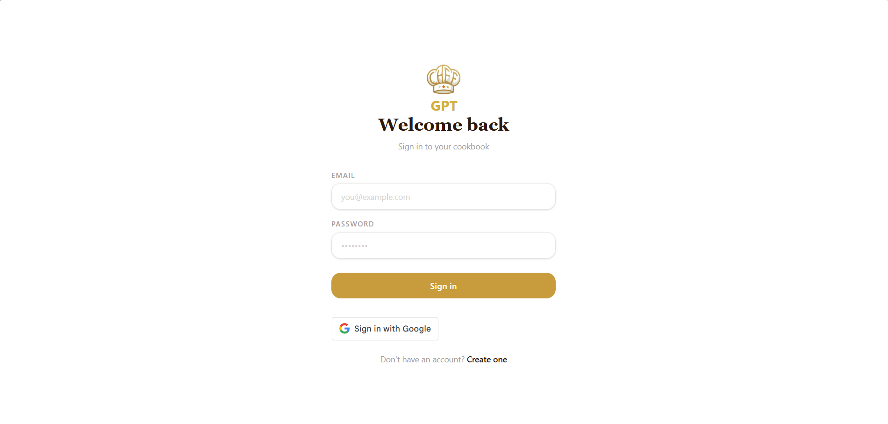
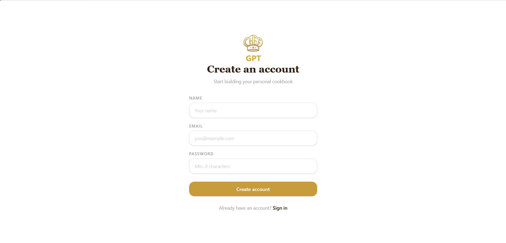
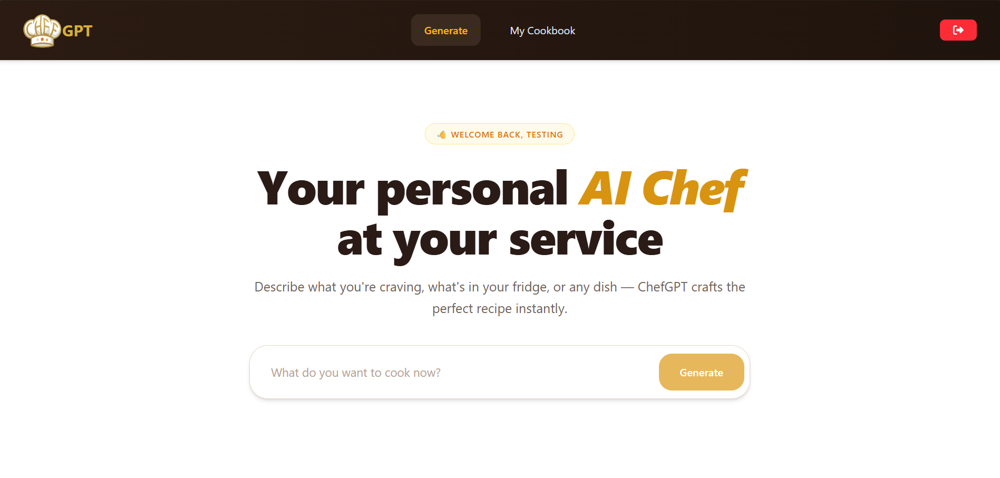
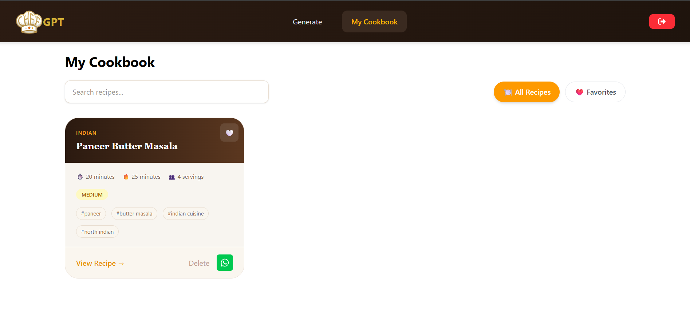
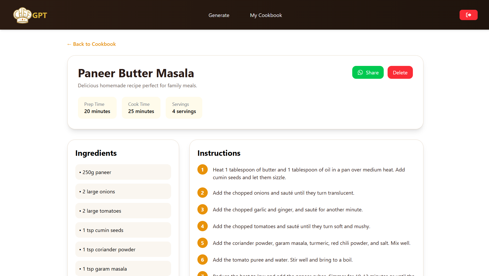

# ChefGPT

ChefGPT is an AI-powered recipe generator that helps users create delicious recipes instantly. Simply describe what you want to cook, and ChefGPT generates a detailed recipe with ingredients, instructions, cooking time, cuisine type, and more.

## Features

* AI-powered recipe generation using Groq LLM
* JWT Authentication
* User Registration & Login
* Personal Cookbook
* Favorite Recipes
* Delete Recipes
* Search Recipes
* Share Recipes via WhatsApp
* Detailed Recipe View
* Protected Routes
* MongoDB Database Storage

## Tech Stack

### Frontend

* React
* React Router
* Axios
* Tailwind CSS
* Vite

### Backend

* Node.js
* Express.js
* MongoDB
* Mongoose
* JWT Authentication
* bcryptjs

### AI

* Groq API
* Llama 3.3 70B Versatile

---

## Project Structure

```bash
ChefGPT/
│
├── frontend/
│   ├── src/
│   ├── public/
│   └── ...
│
├── backend/
│   ├── controllers/
│   ├── models/
│   ├── routes/
│   ├── middleware/
│   └── ...
│
└── README.md
```

## Installation

### Clone Repository

```bash
git clone https://github.com/your-username/chefGPT.git
cd chefGPT
```

### Backend Setup

```bash
cd backend
npm install
```

Create a `.env` file:

```env
PORT=5000
MONGO_URI=your_mongodb_connection_string
GROQ_API_KEY=your_groq_api_key
JWT_SECRET=your_jwt_secret
```

Start backend:

```bash
npm run dev
```

### Frontend Setup

```bash
cd frontend
npm install
```

Create a `.env` file:

```env
VITE_API_URL=http://localhost:5000/api
```

Start frontend:

```bash
npm run dev
```

---

## Authentication

ChefGPT uses JWT Authentication.

### Protected Features

* Generate Recipes
* View Cookbook
* Favorite Recipes
* Delete Recipes
* View Recipe Details

Users must log in before accessing these features.

---

## Screenshots

### Login Page



### Register Page



### Home Page



### Cookbook Page



### Recipe Detail Page



---

## Future Improvements

* Recipe Images
* User Profiles
* Recipe Categories
* Advanced Filters
* Rate Limiting
* AI Image Generation

---

## Author

**Hariharasudhan D**

---

## License

This project is licensed under the MIT License.
